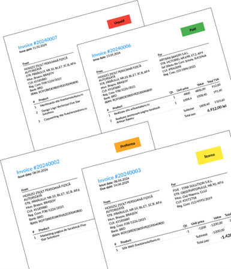
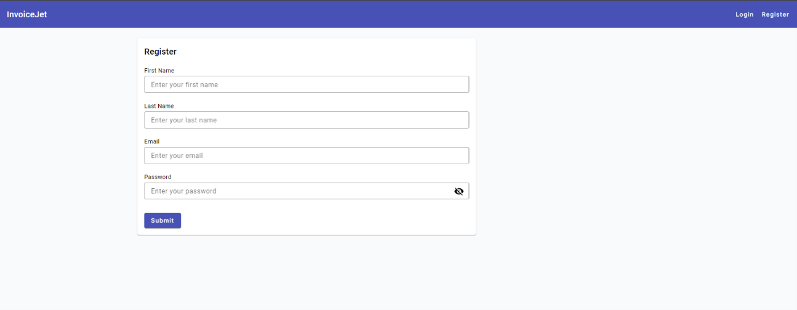
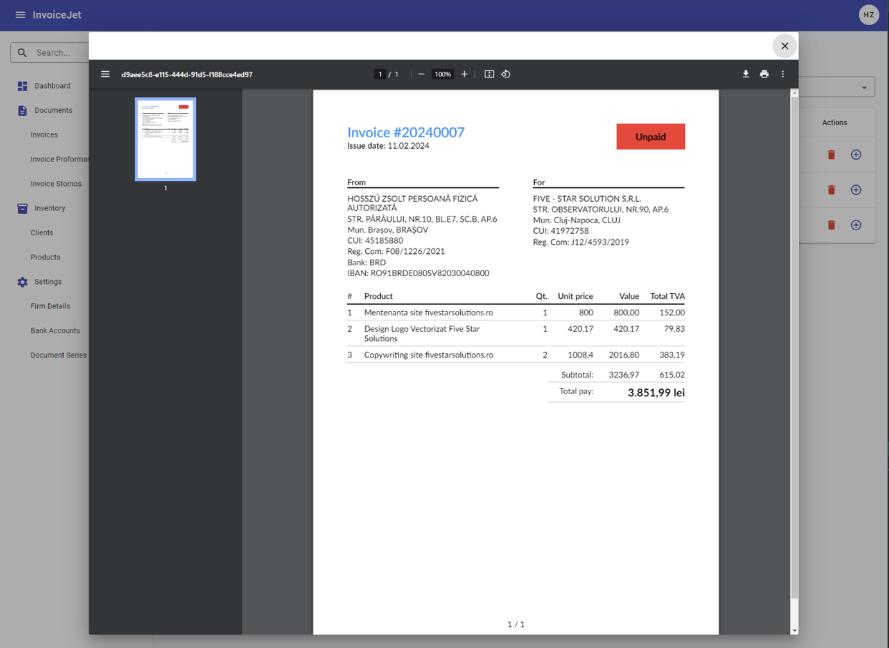
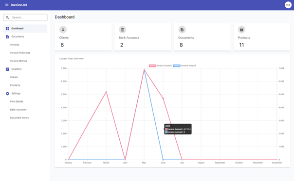
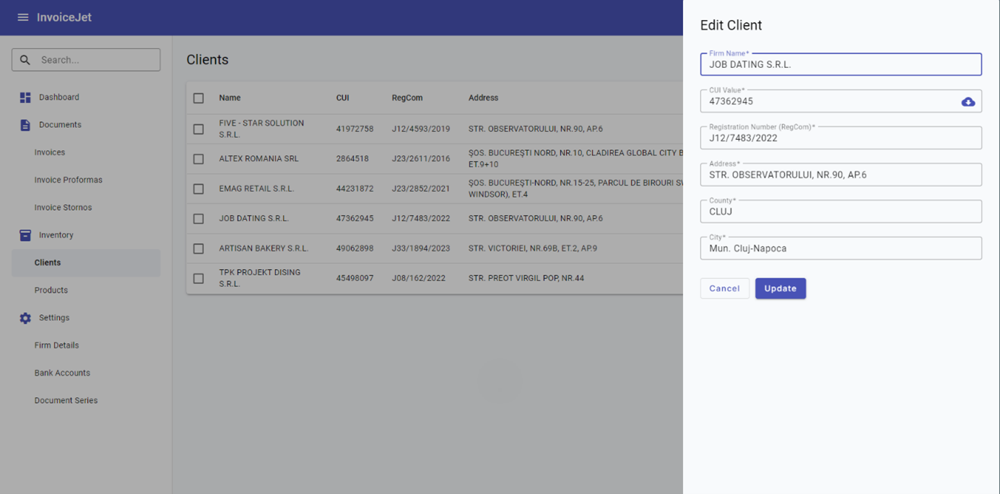
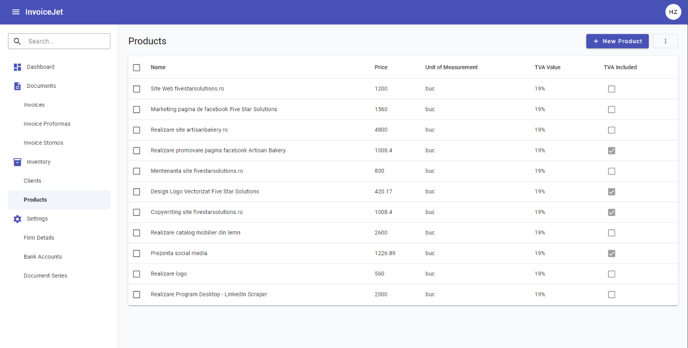
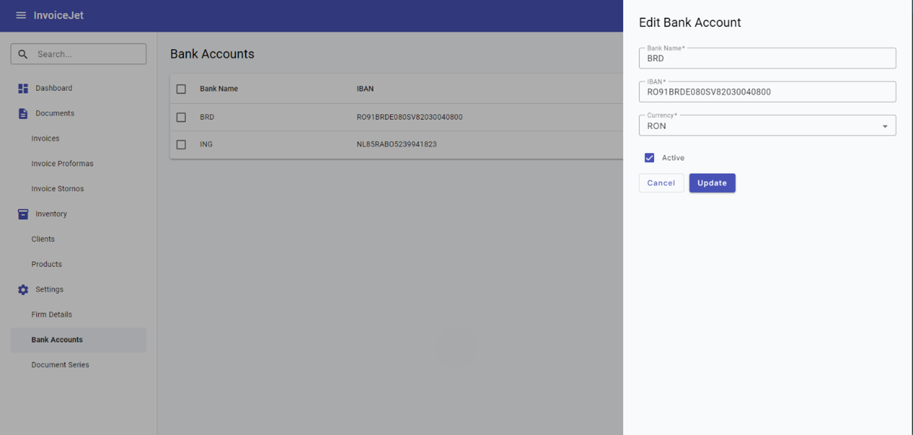
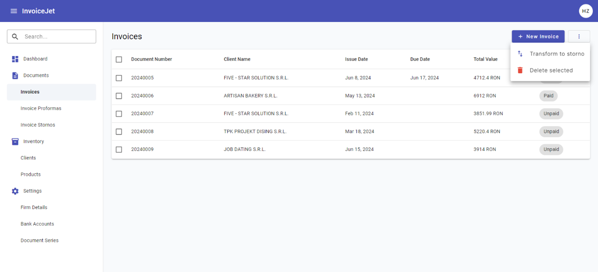
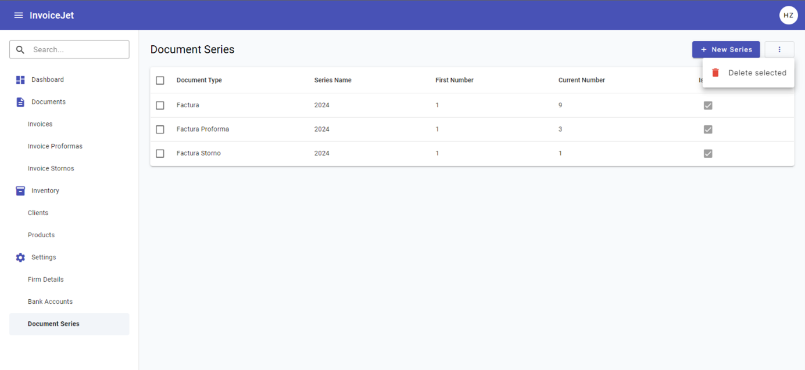
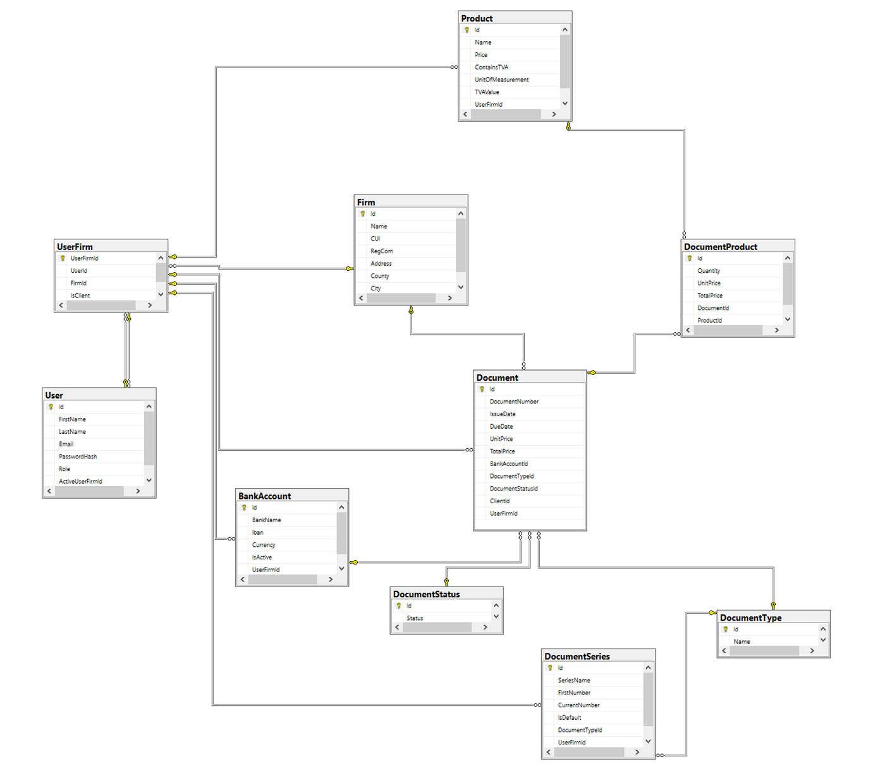

# InvoiceJet

**InvoiceJet** is a modern web application designed to simplify the invoicing and billing process for small and medium-sized companies. Built with .NET and Angular, it offers a user-friendly, robust, and efficient way to manage and issue invoices between companies. The app also integrates with various external services to provide a full-featured billing solution.

 

## Table of Contents

1. [Introduction](#introduction)
2. [Features](#features)
3. [Tech Stack](#tech-stack)
4. [Architecture](#architecture)
5. [Database Structure](#database-structure)

---

## Introduction

InvoiceJet facilitates the invoicing and billing needs of small and medium-sized companies and independent professionals. It provides a free, accessible alternative to existing invoicing solutions, focusing on user experience, security, and ease of use.

### Motivation

The project arose from the need to generate invoices without restrictions or costs associated with third-party platforms. InvoiceJet is designed to be an accessible, powerful, and cost-free option for managing company finances.

## Features

- **User Authentication**: Secure login and registration with JWT-based authentication.

  

- **Invoice Management**: Issue and manage invoices with an intuitive interface.

  

  - **Document Preview**: PDF preview for documents before issuance.

  

- **Interactive Dashboard**: Real-time analytics and summaries.

  

- **Company and Client Management**: Easily organize company information, clients, and banking details.

  
  
  
  
  

- **REST API Integration**: Retrieve tax and business data via ANAF API.
- **Modular Frontend Design**: Built using Angular with Angular Material for a responsive UI.

## Tech Stack

- **Backend**: ASP.NET Core, Entity Framework, QuestPDF for PDF generation, Swagger for API documentation
- **Frontend**: Angular, Angular Material, ng2-charts for data visualization
- **Database**: Microsoft SQL Server
- **Cloud Services**: Microsoft Azure for hosting (was deployed on Azure, but took down because of costs)

## Architecture

InvoiceJet is designed with a clean, modular architecture based on **Clean Architecture** principles and a code-first approach. This ensures scalability, ease of maintenance, and modularity.

### Layered Structure

### 1. Presentation Layer
This layer handles HTTP requests and responses and is responsible for user interaction through API controllers and middleware. It is implemented in the `InvoiceJet.Presentation` project, which includes:
  
- **Controllers**: Handles incoming HTTP requests and routes them to the appropriate services in the application layer.
- **Middleware**: Manages cross-cutting concerns, such as error handling and authentication.
- **Configuration Files**: 
  - `appsettings.json`: Configuration file for application settings.
  - `Program.cs` and other startup files: Set up and configure the application.

### 2. Application Layer
This layer contains the business logic and coordinates the overall workflow of the application. It includes:

- **DTOs** (Data Transfer Objects): Used for data exchange between layers, especially for API requests and responses.
- **MappingProfiles**: Configures mappings for data transformations (e.g., using AutoMapper).
- **Services**: Contains core business logic services that interact with the domain layer and handle application-specific tasks.

### 3. Domain Layer
The core of the application, containing essential business logic and rules. It includes:

- **Models**: Business models that represent the core entities of the application.
- **Interfaces**: Defines contracts for services and repositories.
- **Enums** and **Exceptions**: Custom enumerations and exception handling for domain-specific scenarios.

### 4. Infrastructure Layer
This layer handles database access, external service integrations, and other infrastructural concerns. It includes:

- **Persistence**: Contains the `InvoiceJetDbContext` for Entity Framework Core, responsible for managing database connections and migrations.
- **Repositories**: Implements the data access layer and includes repositories for interacting with the database.
- **Factories** and **Impl**: Factory classes and implementations for creating complex objects, such as document processing components.
- **Migrations**: Manages database schema changes.
- **Services**: Infrastructure-level services, such as PDF generation for invoice documents.

## Database Structure

 
